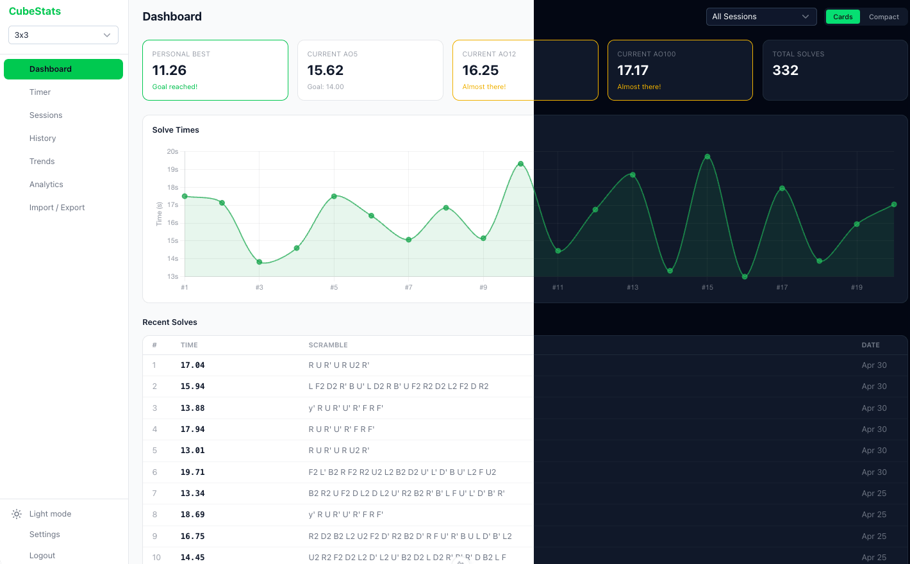
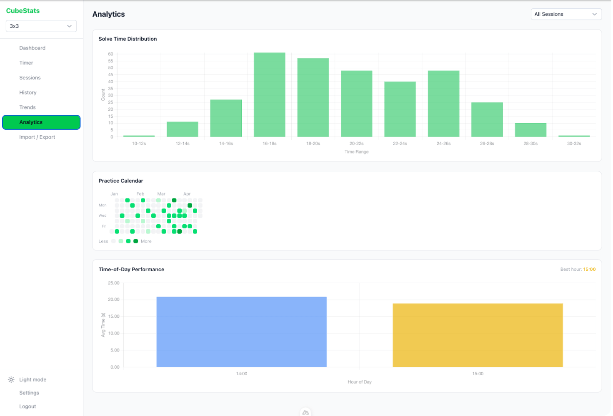
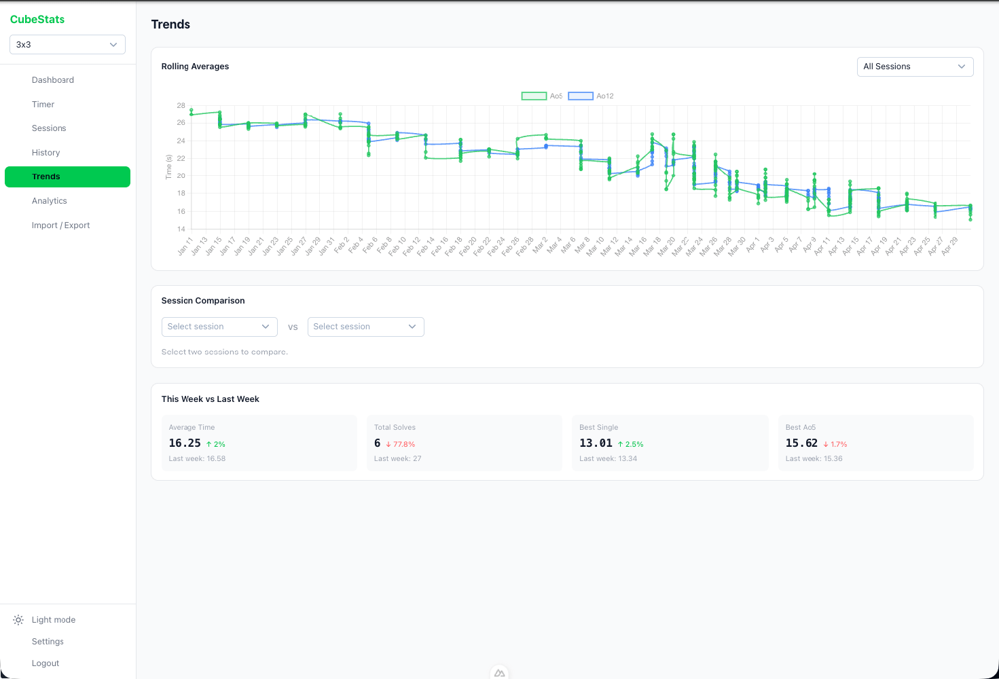
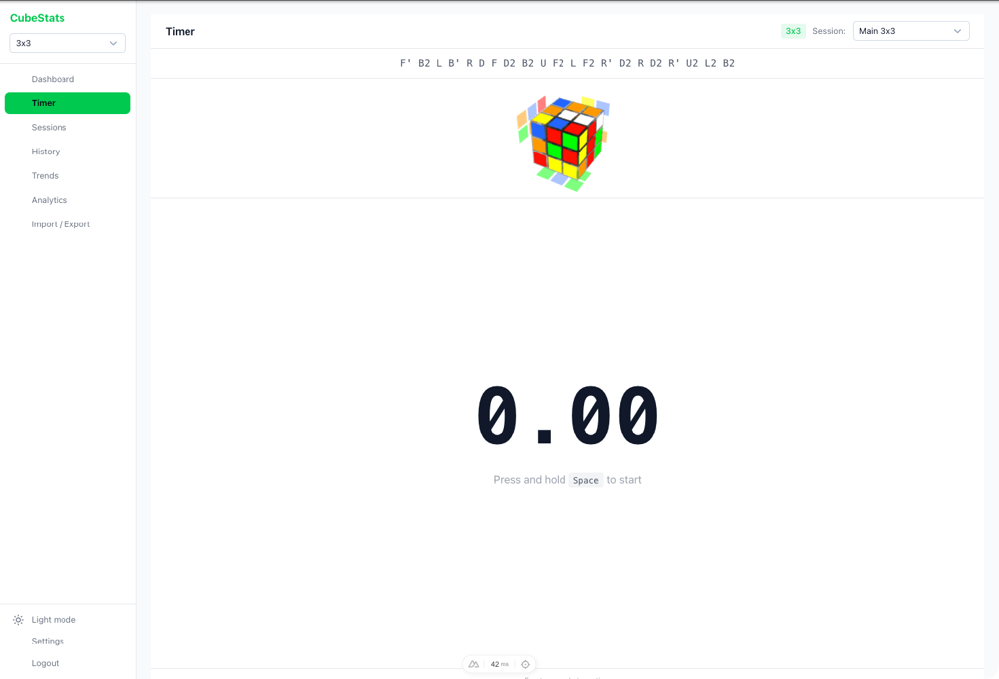
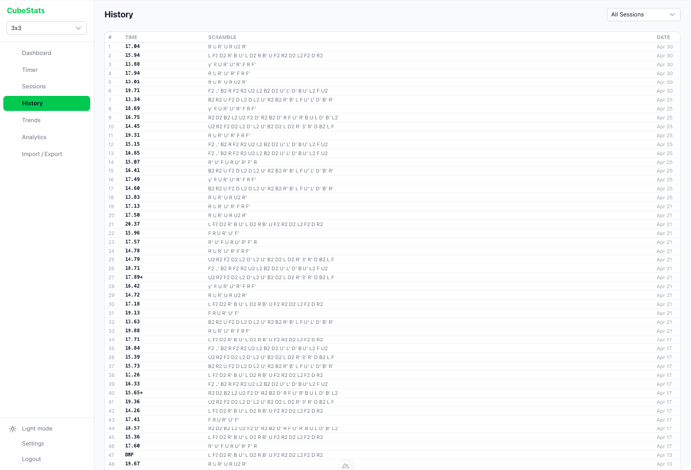
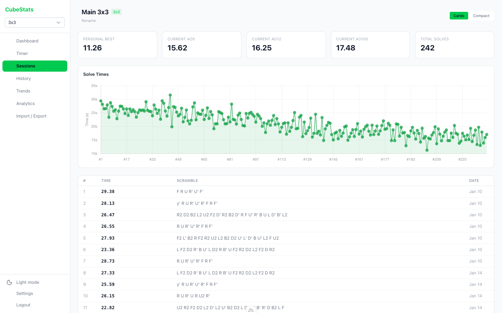
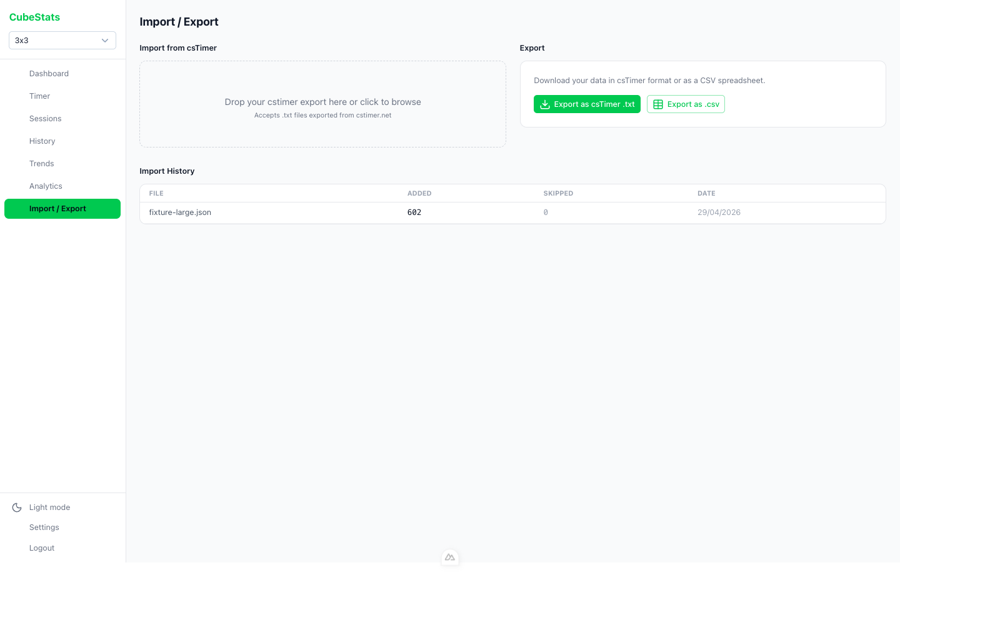

# cubestats

<p align="center">
    
    <br>
    <i>Self-hosted speedsolving timer and stats tracker<br>WCA-compliant scrambles, 3D cube preview, analytics, <a href="https://cstimer.net">csTimer</a> import and more</i>
</p>

> Not affiliated with csTimer.

<picture>
  
</picture>

## Screenshots

<table>
<tr>
<td width="50%">

**Analytics** — distribution, calendar heatmap, time-of-day
<picture>

  <source media="(prefers-color-scheme: dark)" srcset="docs/screenshots/analytics-dark.png">
  
</picture>

</td>
<td width="50%">

**Trends** — rolling averages and week-over-week
<picture>

  <source media="(prefers-color-scheme: dark)" srcset="docs/screenshots/trends-dark.png">
  
</picture>

</td>
</tr>
<tr>
<td width="50%">

**Timer** — WCA scrambles, hold-to-start
<picture>

  <source media="(prefers-color-scheme: dark)" srcset="docs/screenshots/timer-dark.png">
  
</picture>

</td>
<td width="50%">

**History** — searchable solve table with delete
<picture>

  <source media="(prefers-color-scheme: dark)" srcset="docs/screenshots/history-dark.png">
  
</picture>

</td>
</tr>
<tr>
<td width="50%">

**Sessions** — per-session detail and stats
<picture>

  <source media="(prefers-color-scheme: dark)" srcset="docs/screenshots/session-detail-dark.png">
  
</picture>

</td>
<td width="50%">

**Import / Export** — drag-and-drop csTimer JSON
<picture>

  <source media="(prefers-color-scheme: dark)" srcset="docs/screenshots/import-dark.png">
  
</picture>

</td>
</tr>
</table>

## Features

- **Dashboard** — best/avg5/avg12/avg100 with live filters by session and puzzle type
- **CSTimer Integration** - Import / Export CSTimer JSON
- **History** — searchable, sortable solve table with row-level delete
- **Analytics** — solve-time distribution, calendar heatmap, time-of-day breakdown
- **Trends** — rolling averages and session comparisons over time
- **Sessions** — per-session detail pages
- **Built-in timer** — WCA-compliant scrambles via [cubing.js](https://js.cubing.net), inspection countdown
- **Goals** — track targets for any stat metric
- **Import** — drag-and-drop csTimer JSON; deduplicates on re-import
- **Multi-puzzle** — 2x2 through 7x7, megaminx, pyraminx, skewb, square-1
- **Light & dark mode**

## Heads up

cubestats is **single-user** — there's one password and one set of stats. There is no per-user separation, no audit log, no rate limiting on login. Run it on your home network, behind a VPN like [Tailscale](https://tailscale.com), or behind a reverse proxy that handles TLS and access control. Don't expose it directly to the public internet without something in front of it.

If `NUXT_AUTH_PASS` or `NUXT_AUTH_SECRET` look like defaults (`changeme`, `admin`, `password`, anything starting with `change-this` / `dev-secret` / `changeme`), the server refuses to boot — to make sure you set real values before going live.

## Quick start (Docker)

Multi-arch images are published for `linux/amd64` and `linux/arm64`, so a Raspberry Pi 4/5 works out of the box.

Single-container, no compose required. Pick a password and a long random secret:

```bash
docker run -d --name cubestats \
  -p 3000:3000 \
  -v cubestats-data:/app/data \
  -e NUXT_AUTH_PASS='<your-password>' \
  -e NUXT_AUTH_SECRET='<a-long-random-string>' \
  --restart unless-stopped \
  mattyfaz/cubestats:latest
```

Open <http://localhost:3000>, log in, then drop a csTimer export onto the Import page.

### Or with Docker Compose

```yml
services:
  cubestats:
    image: mattyfaz/cubestats:latest
    ports:
      - 3000:3000
    environment:
      - NUXT_AUTH_PASS=<your-password> # required
      - NUXT_AUTH_SECRET=<a-long-random-string> # required
    volumes:
      - cubestats-data:/app/data
    restart: unless-stopped

volumes:
  cubestats-data:
```

The image is published to [Docker Hub](https://hub.docker.com/r/mattyfaz/cubestats) and [GHCR](https://github.com/MattFaz/cubestats/pkgs/container/cubestats). Your data lives in the `cubestats-data` volume — back up `cubestats.db` from inside it to keep your solves safe.

### Updating

```bash
# docker run
docker pull mattyfaz/cubestats:latest && docker rm -f cubestats && <re-run the docker run command above>

# docker compose
docker compose pull && docker compose up -d
```

Migrations run automatically on container start. The published `:latest` tag follows the most recent release; pin to a specific tag (e.g. `mattyfaz/cubestats:v1.03`) if you want to control upgrades manually. Container health is exposed at `/api/health` (no auth required) — a status that reverse proxies and `docker ps` can use.

## Local development

Requires Node 22+. Database is a local SQLite file — no external services needed.

```bash
npm install
cp .env.example .env
# Edit .env — set NUXT_AUTH_PASS / NUXT_AUTH_SECRET to anything
npm run db:migrate    # creates data/cubestats.db
npm run dev
```

## Environment variables

| Var                  | Required | Notes                                                                                                         |
| -------------------- | -------- | ------------------------------------------------------------------------------------------------------------- |
| `NUXT_AUTH_PASS`     | yes      | Login password — refuses to start in production with `changeme`, `admin`, or `password`                       |
| `NUXT_AUTH_SECRET`   | yes      | HMAC secret for the session cookie — refuses to start in production with placeholder values                   |
| `NUXT_DATABASE_PATH` | no       | SQLite file path. Defaults to `data/cubestats.db` (locally) or `/app/data/cubestats.db` (in the docker image) |
| `APP_PORT`           | no       | Defaults to `3000`                                                                                            |

## Exporting from csTimer

In csTimer, open the export menu and choose **Export**. Save the resulting JSON file and drag it onto the Import page in cubestats.

## Scripts

```bash
npm run dev          # Dev server
npm run build        # Production build
npm run preview      # Preview production build
npm run test         # Vitest watch
npm run test:run     # Vitest single run
npm run db:generate  # Generate Drizzle migration from schema
npm run db:migrate   # Apply migrations
npm run db:studio    # Drizzle Studio
```

## Contributing

See [CONTRIBUTING.md](./CONTRIBUTING.md). Security issues: see [SECURITY.md](./SECURITY.md).

## License

[MIT](./LICENSE)

## Acknowledgements

- [csTimer](https://cstimer.net) — the timer this tool reads from
- [cubing.js](https://js.cubing.net) — scramble generation
